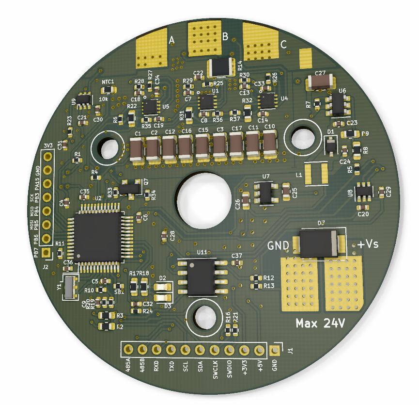
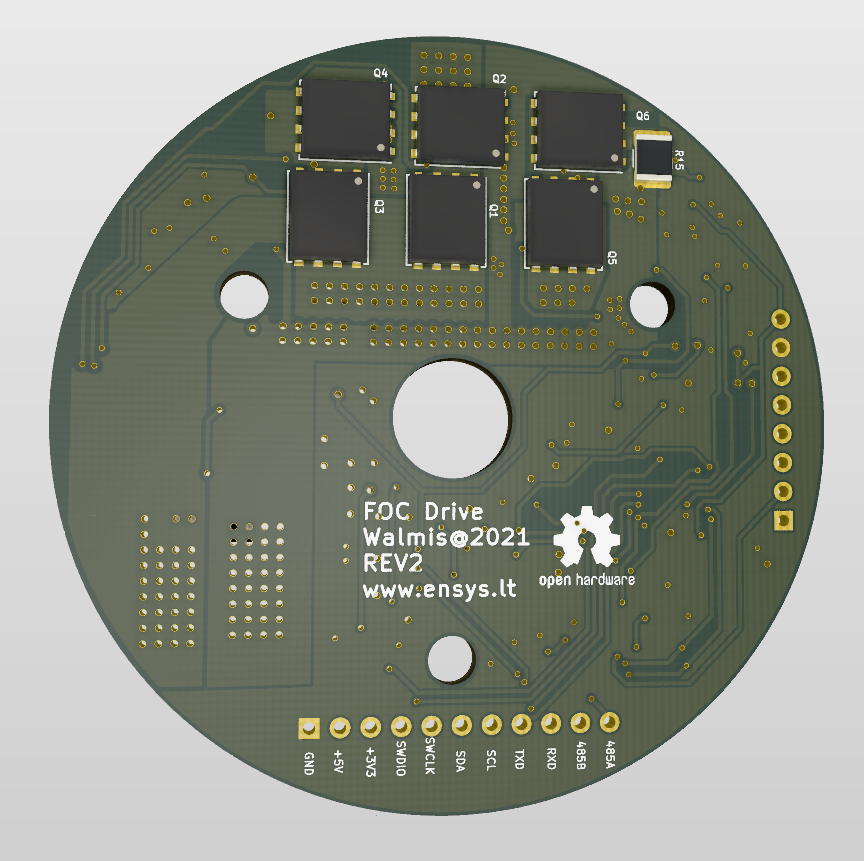

# BLDC-Servo

This project implements a FOC motor controller board for 57BLF0x series NEMA brushless motor.

The project goals are:
* to be inexpensive
* fully support FOC drive
* smooth operation for FFB devices
* Large stalled torque == relatively large current drive

The main components are:
* STM32L412 or STM32F103C8T6 MCU
* NCP81151 - MOSFET Gate drivers
* NCS213/INA213 current sense amplifiers
* FDMS8018 N-channel MOSFETS (can be any TDSON-8 30V>= MOSFETS with required current rating)
* MP2359 DC-DC step-down
* SN75176B RS485 transceiver

The board attaches directly to the motor casing with mosfets in direct contact (with thermal paste). This makes a good heatsink for power dissipation.

